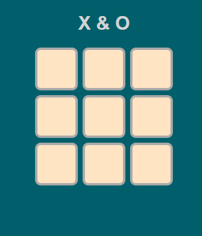

### Tic-tac-toe with Alpha-Beta pruning

Deployment: https://jakobagger.github.io/tic-tac-toe/

### Beskrivelse:

Kryds og bolle-spil hvor en menneskelig spiller kan spille mod computeren. Når spilleren tager et træk (vælger et felt), tænker computeren over sit træk og vælger så et felt. Den første af de to der har tre på stribe af sit symbol (X for spiller, O for computer) vinder. Hvis brættet bliver fyldt uden der er fundet en vinder er spillet uafgjort.
